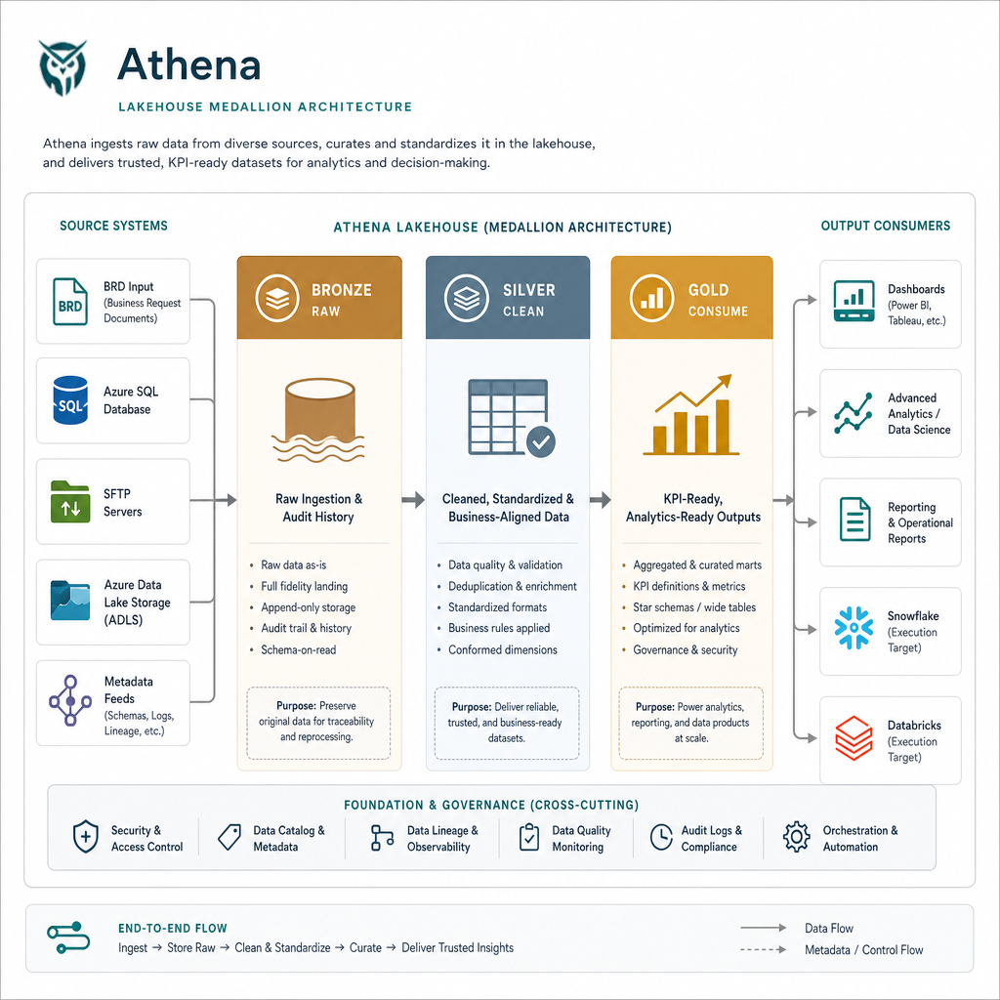
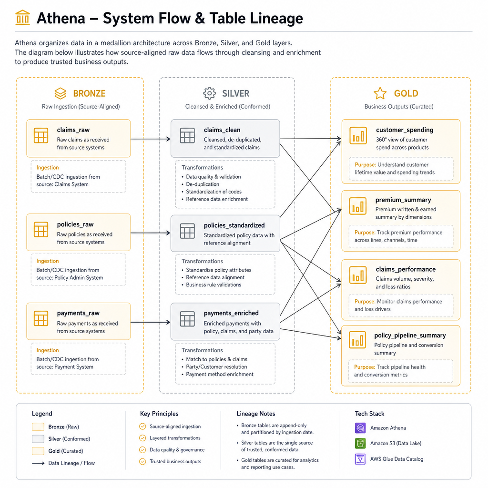
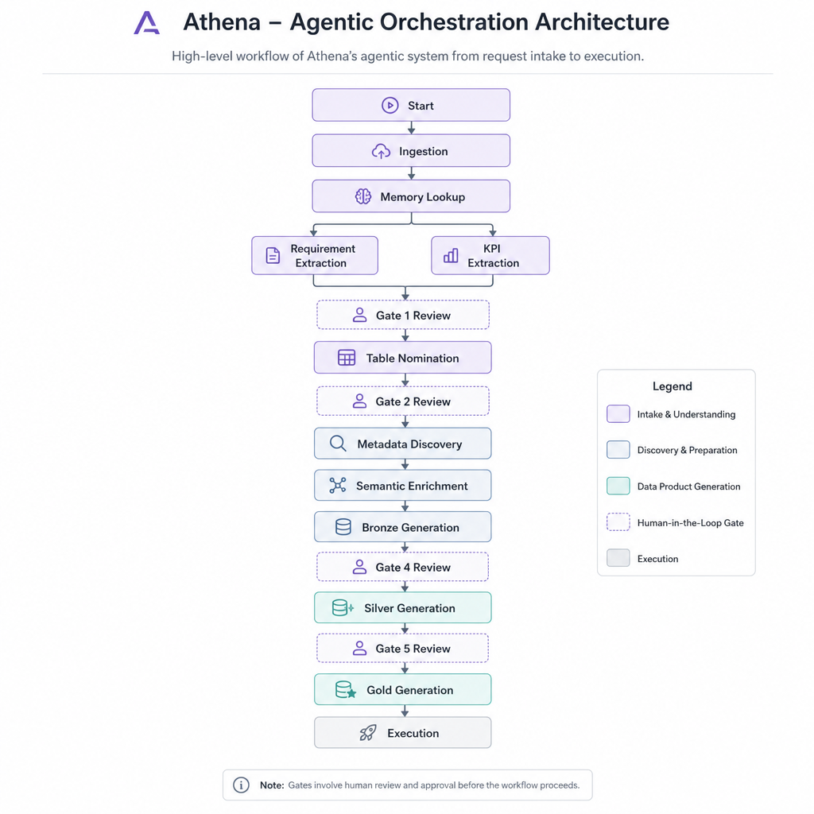
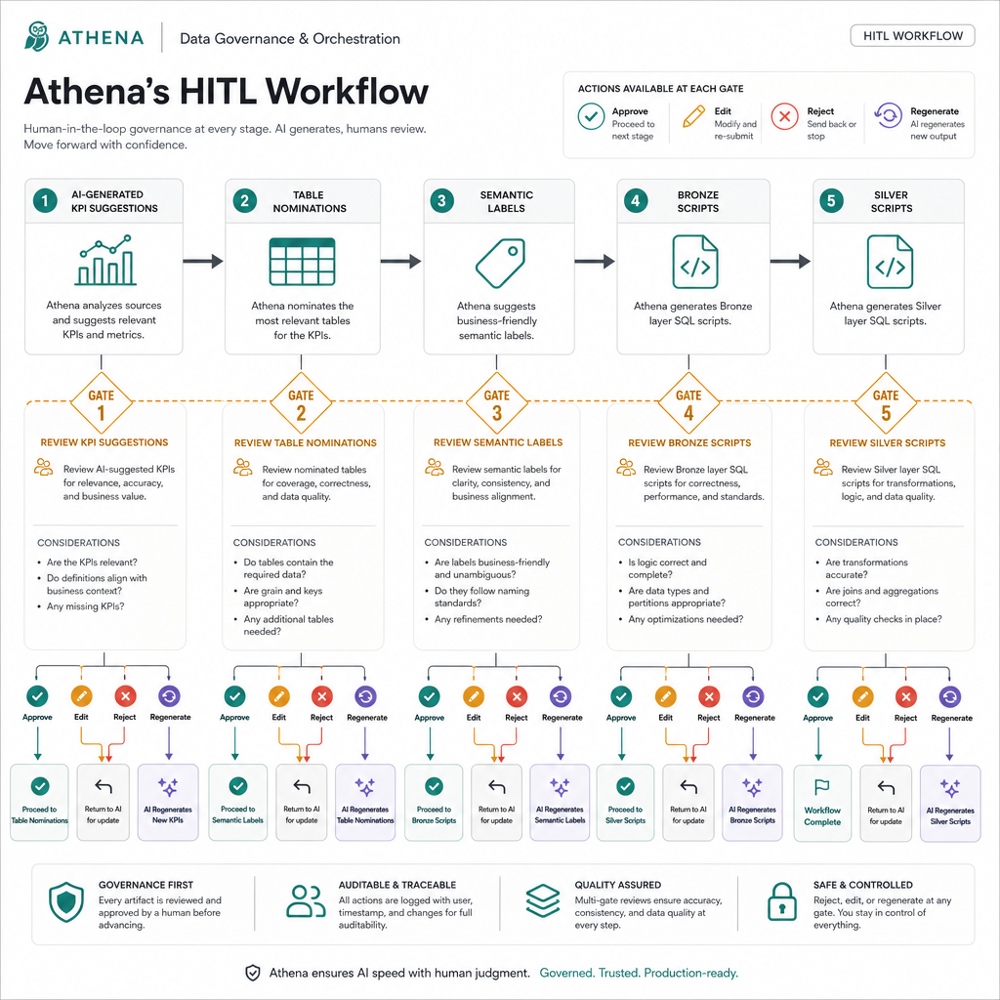
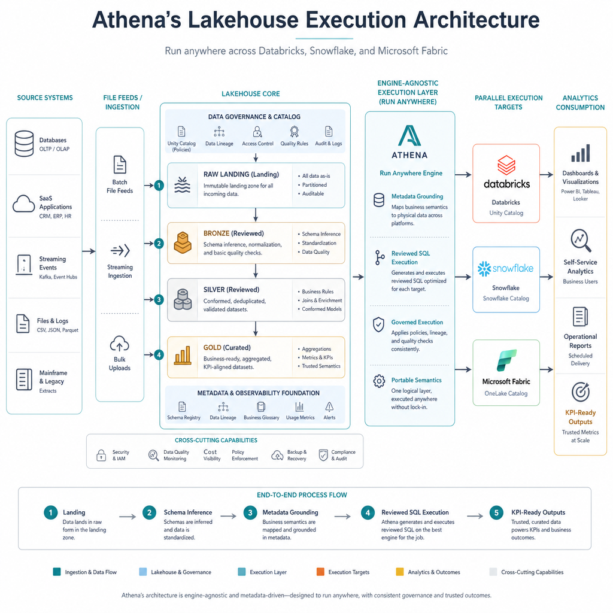

  

# Athena

Athena is an agentic data-orchestration product that converts business requirements into governed, reviewable, analytics-ready data pipeline outputs.

It sits between business intent and warehouse execution. Instead of relying on disconnected analyst handoffs, manual source discovery, and late-stage SQL review, Athena turns the full lifecycle into a visible system with AI reasoning, metadata grounding, human approval gates, and layered Bronze, Silver, and Gold outputs.

---

## Product Summary

Athena is built for teams that need to move from a BRD or business request to trusted data outputs without losing control along the way.

It helps solve common enterprise analytics problems:

- business requests arrive in natural language, not structured data contracts
- KPI definitions are vague, duplicated, or inconsistent
- source table selection depends too heavily on tribal knowledge
- metadata is fragmented across databases and file feeds
- transformation logic gets reviewed too late

Athena addresses that by creating a governed path from intake to execution-ready outputs.

At a high level, Athena:

- ingests BRDs, text inputs, or feed-driven requirements
- extracts business goals and KPI candidates
- reuses historical context where similar runs already exist
- nominates likely source tables and supporting entities
- discovers metadata directly from source systems and file feeds
- inserts human review where trust matters
- generates Bronze, Silver, and Gold pipeline assets
- supports reviewed execution paths for warehouse targets such as Snowflake

---

## Architecture Deep Dive

### Medallion Architecture Implementation

Athena uses a medallion-style output model so raw ingestion, business cleanup, and analytics consumption are clearly separated.

### Bronze Layer

- Represents raw ingestion and source fidelity.
- Preserves the original source structure as closely as possible.
- Adds audit context such as run identifiers, ingestion timestamps, and source references.
- Serves as the controlled landing zone before business cleanup begins.

Typical Bronze responsibilities:

- landing source-aligned database tables
- loading file feed structures into raw entities
- preserving lineage and source history
- isolating raw data quality issues from downstream business models

### Silver Layer

- Represents cleaned, standardized, and merge-ready business data.
- Applies semantic cleanup, merge logic, controlled casts, and curated transformations.
- Converts raw ingestion outputs into reusable business entities.
- Becomes the main layer for trusted intermediate data modeling.

Typical Silver responsibilities:

- standardization of names and types
- merge-key-aware deduplication and matching
- enrichment with reviewed semantic meaning
- alignment across multiple feeds or operational sources

### Gold Layer

- Represents KPI-ready and analytics-ready outputs.
- Produces fact-style and business-summary datasets designed for reporting and decision support.
- Connects source-grounded transformations to measurable business outcomes.

Typical Gold responsibilities:

- KPI-level aggregates
- business-performance summaries
- fact and dimension style outputs
- presentation-ready analytics tables for dashboards or reporting consumers

### Why This Layering Matters

- It separates raw fidelity from business interpretation.
- It makes quality issues easier to isolate.
- It supports clearer lineage from source to KPI.
- It creates a safer review model before executable logic is promoted.

---

## Our Data Flow

Athena follows a structured progression from source-aligned entities to analytics-ready outputs.

### Source Inputs

Athena can operate across more than one source pattern:

- business requirement documents and freeform BRD text
- Azure SQL and other operational database metadata
- SFTP-delivered file feeds
- ADLS-based landing feeds

### Source-Aware Landing

Athena treats landing as a controlled raw ingestion stage.

- For database sources, it grounds transformations using discovered source metadata.
- For file sources, it can inspect sample files or registered feed structures.
- For Snowflake-oriented flows, raw landing may be created first and typed business logic applied later in Bronze.

### Business-Aligned Progression

The system does not jump directly from a document to a final dashboard table.

Instead it moves through:

1. intent understanding
2. KPI shaping
3. source nomination
4. metadata grounding
5. reviewed transformation generation
6. layered output promotion

This staged progression is one of Athena's key strengths because it keeps AI reasoning tied to data reality.

---

## Agentic Workflow Architecture

Athena is not a single prompt or a one-shot generator. It is an orchestrated workflow with specialized stages that each solve a specific problem in the requirement-to-pipeline lifecycle.

The orchestration flow includes:

- ingestion
- memory lookup
- requirement extraction
- KPI extraction
- KPI review
- table nomination
- table review
- metadata discovery
- semantic enrichment
- Bronze generation
- Bronze review
- Silver generation
- Silver review
- Gold generation
- execution

### Agent Roles Inside the Workflow

Athena behaves like a coordinated set of focused responsibilities rather than one general-purpose assistant.

Core roles include:

- requirement interpretation
- KPI candidate generation
- metadata-aware source discovery
- semantic enrichment and key reasoning
- code and SQL generation for layered outputs
- review-aware orchestration and stage progression

### Why the Agentic Model Matters

- Business requests are ambiguous.
- Metadata is technical and often incomplete.
- Table nomination benefits from both semantic and structural evidence.
- Review gates are easier to manage when the pipeline is stateful and stage-based.

Athena uses orchestration to make that complexity visible and governable instead of hiding it inside one large LLM response.

---

## HITL (Human-in-the-Loop) Workflow

Human review is built into Athena at the points where automation risk is highest.

The product uses review gates to ensure that interpretation quality is validated before downstream execution assets are produced or promoted.

### Gate 1: KPI Review

- reviewers inspect candidate KPIs
- weak or incorrect business metrics can be rejected early
- approved KPIs become the basis for later source discovery

### Gate 2: Table Review

- nominated source tables are reviewed before metadata discovery and deeper shaping continue
- this protects the pipeline from building on the wrong source foundation

### Gate 3: Semantic or Enrichment Review

- semantic types, join-key assumptions, and enrichment decisions can be validated before transformation logic depends on them

### Gate 4: Bronze Review

- generated Bronze logic is reviewed before execution or promotion
- source fidelity, merge assumptions, and landing expectations can be inspected here

### Gate 5: Silver Review

- cleaned and standardized business transformations are reviewed before final Gold shaping proceeds

### Why HITL Is a Product Feature

- it creates trust in AI-assisted delivery
- it supports governance and accountability
- it prevents bad early assumptions from scaling into production logic
- it keeps business and engineering aligned through the pipeline lifecycle

---

## Lakehouse Execution Flow

Once Athena has moved through requirement understanding, source grounding, and review approval, it transitions from analysis into controlled execution planning.

This stage shows how Athena connects the medallion model to actual warehouse delivery:

- raw and landing structures are prepared before business-facing transformations are promoted
- Bronze outputs preserve source fidelity and auditability
- Silver outputs apply reviewed cleanup, standardization, and merge logic
- Gold outputs shape KPI-ready and analytics-ready datasets for downstream consumption

### Why This Execution Layer Matters

- it connects architecture decisions to operational outcomes
- it makes the platform useful beyond recommendation or documentation
- it shows stakeholders how approved logic becomes warehouse-ready assets
- it reinforces that Athena is not only extracting KPIs, but carrying them through to data-product execution

For teams using Snowflake-oriented execution, this stage is where approved generated SQL can be promoted after the relevant review gates complete.

---

## Source Discovery and Metadata Grounding

Athena combines AI assistance with deterministic metadata reads so downstream transformations are grounded in actual source structures.

### For Database Sources

- source metadata is read directly from the operational database
- table and column structures are used to support nomination, enrichment, and transformation shaping
- business logic is tied to real source schema rather than guessed schema

### For File Sources

- Athena can inspect sample files from SFTP or ADLS-style feeds
- schema structure can be inferred from those inputs before downstream steps continue
- feed-level metadata becomes part of the pipeline's decision context

### For Warehouse-Oriented Execution

- landing, raw ingestion, and transformation promotion are separated
- Athena can support reviewed warehouse execution paths after earlier stages are approved
- Snowflake-oriented runs follow a staged flow where approved generated SQL is executed only after the relevant review gates complete

---

## What Athena Produces

A successful Athena run produces more than a generated query.

It produces a chain of traceable artifacts:

- normalized requirement context
- candidate and approved KPI definitions
- candidate and approved source mappings
- discovered metadata and semantic context
- Bronze transformation outputs
- Silver transformation outputs
- Gold business outputs
- execution status and pipeline visibility artifacts

This chain is important because it preserves explainability between business intent and data implementation.

---

## Product Surfaces

From the application structure in this repository, Athena functions as a control plane for AI-assisted pipeline delivery.

Key user-facing surfaces include:

- run intake and BRD submission
- pipeline DAG and stage-progress tracking
- KPI and table review work queues
- semantic review experiences
- source-system and database configuration
- warehouse execution monitoring
- cost and runtime visibility

That makes Athena more than a backend engine. It is a workflow product for teams coordinating around data delivery decisions.

---

## Why Athena Matters

Athena reduces the distance between what the business asks for and what the data platform can trustfully execute.

It does that by combining:

- AI-assisted requirement understanding
- source-aware metadata grounding
- human governance at decision boundaries
- layered medallion outputs
- execution-aware orchestration

The product is strongest in environments where:

- requirements arrive as documents rather than structured tickets
- source systems are fragmented or poorly documented
- governance is required before execution
- delivery teams want speed without losing control
